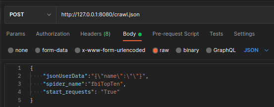

# Web Scraping - FBI Top-Ten
This project was designed as a base to create a rest api that allows us to consume resources and extract data from external sources... That is, an application that allows us to extract information from websites for the categorization and organization of data with the option of being able to save them or simply consult them when necessary.

For this example we will use the official ***[FBI (Top-Ten)](https://www.fbi.gov/wanted/topten "FBI (Top-Ten)")*** website and extract the list of the 10 most wanted with the respective information about each one or individually.

## Requirements
The requirements are

```bash
sudo apt install -y python3-pip
sudo apt install -y python3-venv
```
## Config

Once the prerequisites are installed, we will continue with the main requirements where the first step is to create our virtual environment in the path indicated by the image, to create our environment the command is executed; ```python3 -m venv venv```***(this corresponds to the name you want to give your environment).***


The next step is to activate the virtual environment

```bash
source FBI/venv/bin/activate
```

once your environment is active, we will install all the requirements using the ***[requirements.txt](FBI/requirements.txt)*** file with the following command.

```bash
sudo pip3 install -r requirements.txt
```
Once the previous steps are completed, we will proceed to replace 2 files located in the scrapyrt folder of our virtual environment, the two files are:

/FBI/***venv***/lib/python3.10/site-packages/scrapyrt/conf/***default_settings.py***

/FBI/***venv***/lib/python3.10/site-packages/scrapyrt/***resources.py***

As indicated in the following images


## Quick Start

To start our service, we need to go to the path where our spider is located, in this case the path is:

***FBI/externalSources/projects/fbitopten/scrapyFbi***

Once located in the path of our spider we execute the following command (Remember that we do all this with our active virtual environment)

```bash
cd FBI/externalSources/projects/fbitopten/scrapyFbi
scrapyrt -i 0.0.0.0 -p 8080
```

The following image shows us the route where we execute the service with scrapyrt, the environment that I am using and the scrapyrt output when executed.


To consume our service we use Postman, there are two ways to bring all the data and they are evidenced in these two images.



The answer you should have would be something like this example.


## Documentation and references
***[Scrapyrt](https://scrapyrt.readthedocs.io/en/stable/ "Scrapyrt")***
***[Scrapy](https://docs.scrapy.org/en/latest/ "Scrapy")***

## License

This program is free software; you can redistribute it and/or modify it under the terms of the GNU General Public License as published by the Free Software Foundation; either version 3 of the License, or any later version.

This program is distributed in the hope that it will be useful, but WITHOUT ANY WARRANTY; without even the implied warranty of MERCHANTABILITY or FITNESS FOR A PARTICULAR PURPOSE. See the GNU General Public License for more details.

You should have received a copy of the GNU General Public License along with this program; if not, write to the Free Software Foundation, Inc., 59 Temple Place, Suite 330, Boston, MA 02111-1307 USA

See './LICENSE' for more information.
